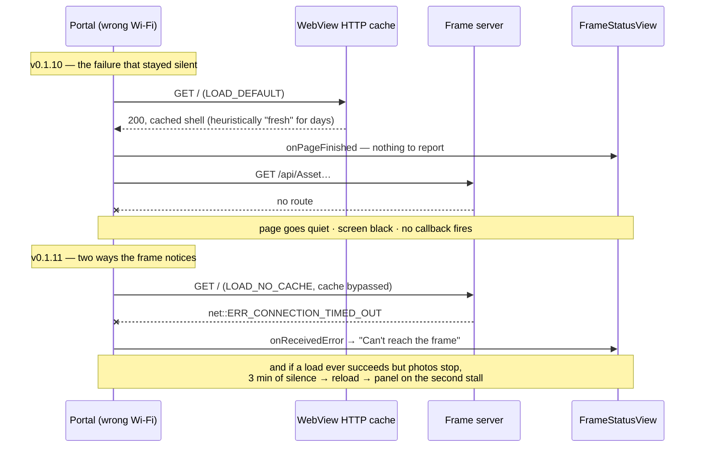

# ADR-0007: Watch a loaded page, not just its navigation

**Status:** accepted (2026-08-18), implemented in v0.1.11
**Context:** the London Portal spent at least a day showing a black screen, and the
failure panel that shipped in v0.1.8 did not appear.

## What happened

The Portal had joined `192.168.20.0/24` — the ISP router's own Wi-Fi, not the LAN
that routes to the cluster. The frame endpoint resolves publicly to an internal
address (`10.0.20.203`) and is gated to the home LANs, so from that network there is
no route to it at all.

Since v0.1.8 the app can say exactly that. It did not fire, for a chain of reasons:

- The frame page is served without a `Cache-Control` header, so Chromium applies
  heuristic freshness — about 10% of the file's age, which for a shell built weeks
  earlier is several days.
- The WebView ran with `cacheMode = LOAD_DEFAULT`, so the launch was answered from
  its own disk cache. That is a **successful navigation**: `onReceivedError` and
  `onReceivedHttpError` are per-load callbacks, and neither one fires.
- The page booted, made its first photo request, and that request died. DevTools
  attached to the device recorded zero network events in 75 seconds — a page that
  had given up rather than one still trying.

Everything the app knew how to describe was a failure of a load, and this was not
one. The evidence from the device: page title `highlights-immich.viktorbarzin.me`
(the real page, not a WebView error page), `192.168.20.195/24` with no route to
`10.0.20.203`, `FrameActivity` resumed, screen black.



## Decision

**A successful navigation is not evidence that the frame is working.** Two changes,
both in the app; the LAN-only gating and the server stay as they are.

1. **The document is never served from the WebView's cache** (`LOAD_NO_CACHE`). A
   launch on a network with no route home fails for real again, which the existing
   panel already explains well. The whole shell is 2 KB of HTML and 72 KB of JS, so
   the cost is ~74 KB per load, and loads are rare.

2. **Silence is watched for** (`FrameHealth`). A working frame requests a photo every
   `Interval` seconds — 30 on the London frame, 45 on Sofia's. Three minutes with no
   `/api/` request from a page that loaded is treated as a stall: the first one gets a
   quiet reload, because most stalls heal and a panel that appears on a wall for a
   moment is more disruptive than the stall it reports; a second stall in a row puts
   the panel up and leaves it there until photos actually return.

The reload is also the probe. It either brings photos back or fails for real, and a
real failure carries a better message than the watchdog could compose.

## What the wall says

| Situation | Headline |
|---|---|
| Nothing answered — no route, no DNS, refused, timed out | *Can't reach the frame*, with the WebView's `net::ERR_…` |
| The server answered 403 — outside the home LANs | *Not allowed from this network* |
| The page loaded, then stopped showing photos | *The frame stopped showing photos*, with how long since the last one |

Every panel also carries the frame URL, this device's IPv4 address and gateway, and a
retry count — the facts that separate "this Portal moved" from "the server is down"
for someone standing in front of it with no logs and no adb.

## Alternatives considered

- **A periodic HTTP probe from Kotlin.** Independent of the page and it names the
  status code, but it adds steady traffic and stays green while the server is fine and
  the page is dead — one of the black-screen modes seen here.
- **A JavaScript bridge into ImmichFrame.** The most accurate answer to "are photos
  advancing", at the cost of coupling to the page's internals and adding a JS→native
  surface in a kiosk WebView.
- **`Cache-Control: no-store` on the ingress.** Fixes every client at once, but Traefik
  cannot condition the header on content type, so it would also stop the hashed
  `/_app` chunks being cached, so every viewer would re-download them on each load.
- **Alerting on a silent frame.** A Prometheus rule over `traefik_router_requests_total`
  would have caught this the same day. Not adopted for now: the panel puts the answer
  on the screen where the question comes up. An alert can be added later if a silent
  frame needs to reach someone who is not in the room.

## Trade-off accepted

The stall check matches `/api/` rather than any request at all, so it measures photo
traffic specifically. If ImmichFrame ever moves its endpoints off that prefix, a
healthy frame would look silent and reload every three minutes with a panel on top.
Chosen knowingly: the prefix covers `Asset`, `AssetInfo` and `AssetFaces` together, so
a single endpoint rename cannot cause it, and a reload rhythm of exactly three minutes
is visible in the Traefik logs if it ever happens.

## Verified

On the London Portal, on the failing network, 2026-08-18. After installing v0.1.11 the
document request went out un-cached, failed with `net::ERR_CONNECTION_TIMED_OUT` after
about 95 seconds of a blackholed connect, and the panel came up reading:

```
Can't reach the frame
net::ERR_CONNECTION_TIMED_OUT — nothing answered at this address.
Frame: https://highlights-immich.viktorbarzin.me
This device: 192.168.20.195, gateway 192.168.20.1
Retrying every 5s — attempt 2
```

The frame returns to photos on its own once the Portal rejoins a home network — the
retry loop keeps running behind the panel.
